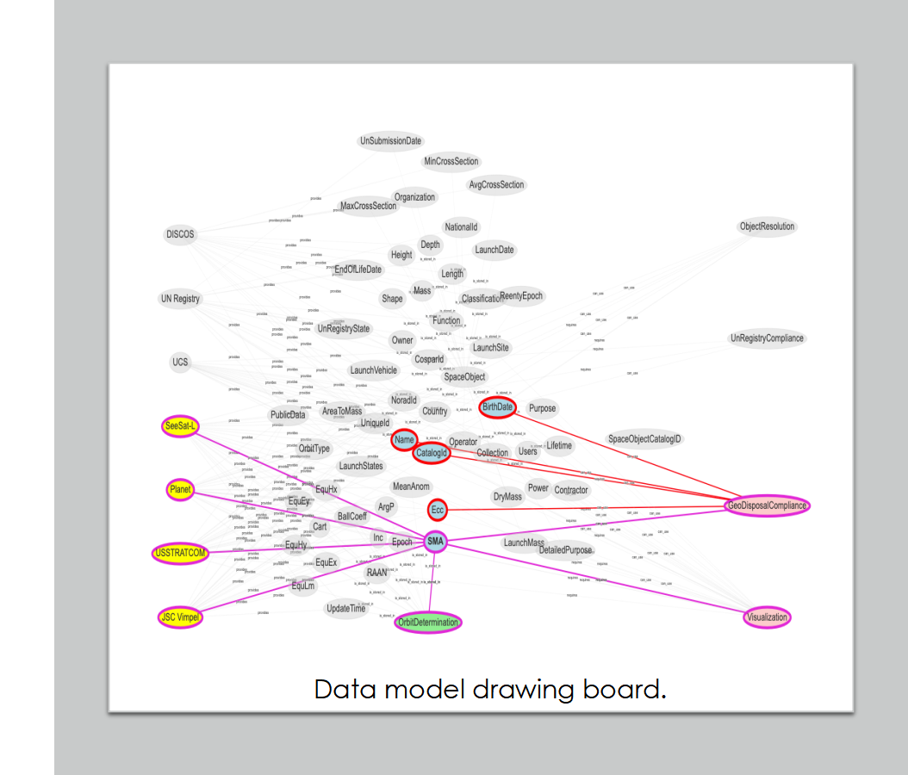
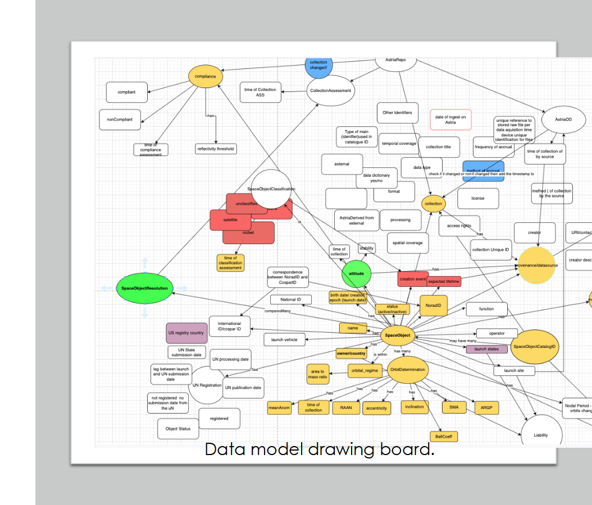
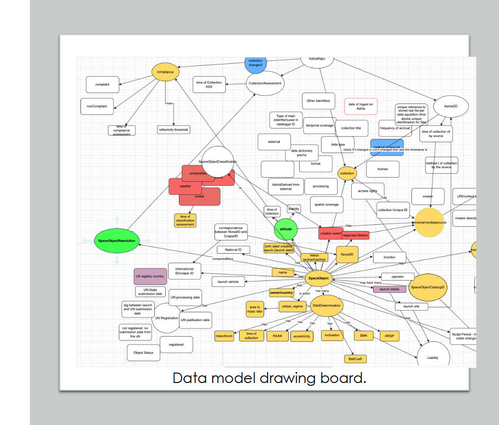
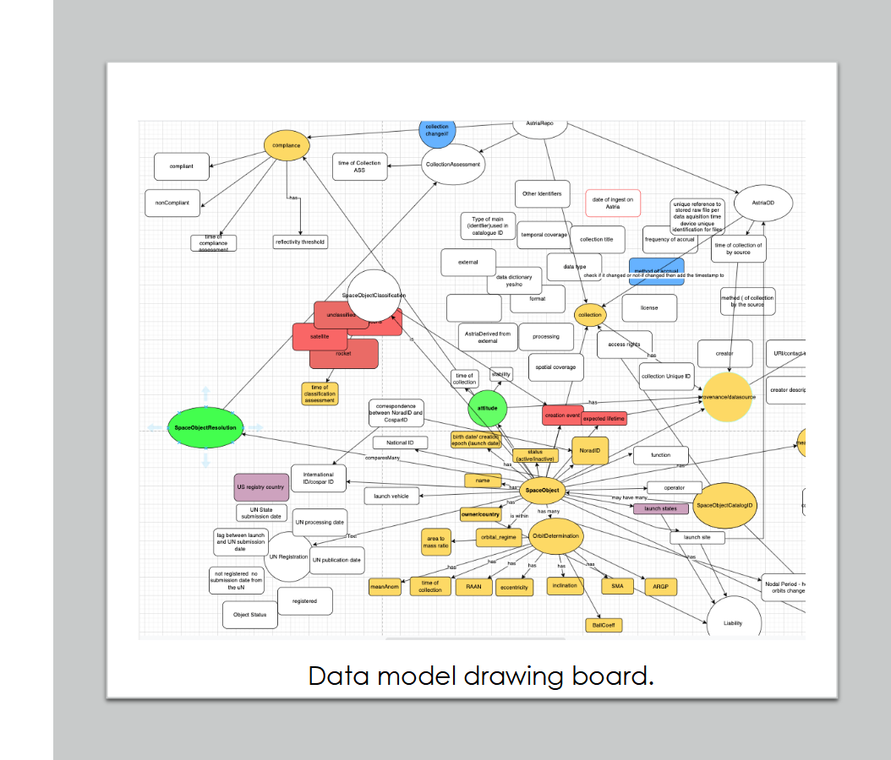
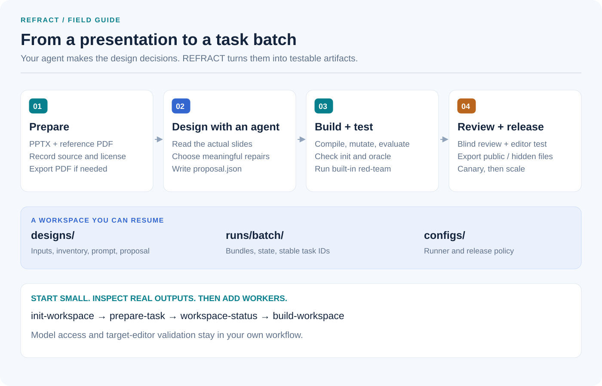
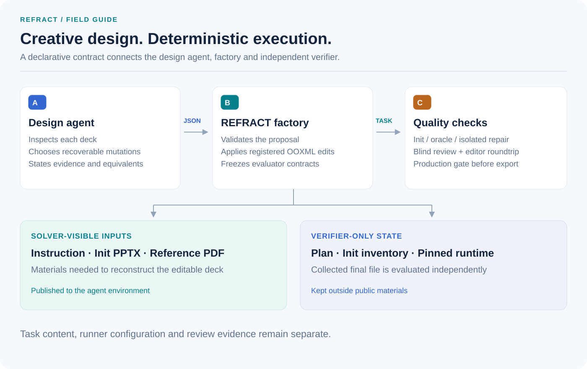
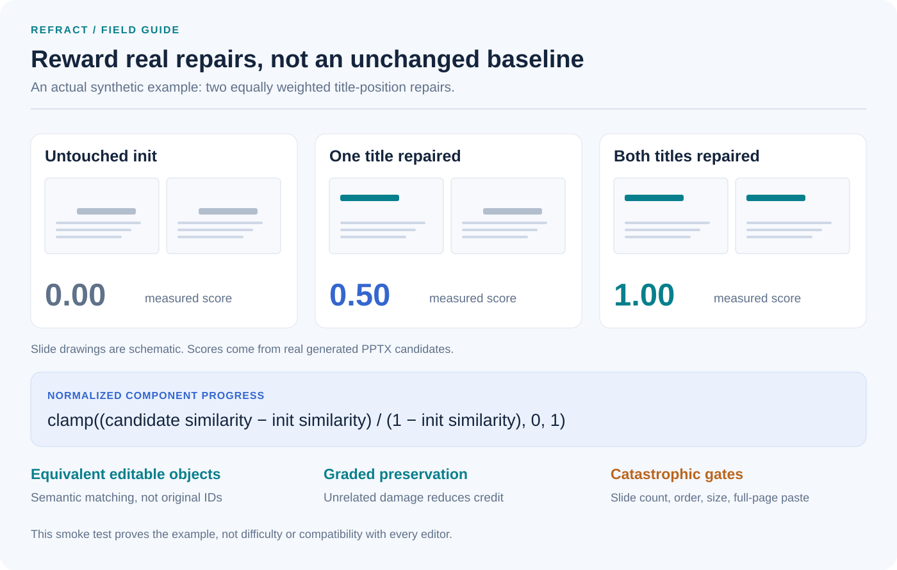

# REFRACT

[](https://github.com/Haikong-Lu1206/REFRACT-PPTX/actions/workflows/ci.yml)
[](LICENSE)
[](https://github.com/Haikong-Lu1206/REFRACT-PPTX/releases)

**Design, generate and evaluate editable presentation repair tasks.**

**Reference-guided Evaluation Framework for Reconstruction and Agent-designed Controlled Transformations**

REFRACT is an agent-guided factory for mining real presentations, designing controlled
failures, and building robust reconstruction tasks. It combines presentation-specific
reasoning with deterministic OOXML mutation, normalized evaluation, and adversarial gates.

**Built from real frontier-model rollouts, not just synthetic corruption.** REFRACT distills
the maintainers' experience scaling presentation tasks, studying model trajectories, finding
unfair scores and shortcut solutions, and iterating on task design and evaluation. That
experience is the foundation of the project: presentation-specific task design, credit for
honest partial repairs, tolerance for equivalent objects, and checks on the saved artifact.

The methodology comes from an iterated production pipeline; this open-source implementation
is a scoped Alpha migration. See [rollout-driven design and evaluation evidence](docs/empirical-evidence.md)
for concrete examples, a calibration failure, and the boundary between historical evidence
and what you can reproduce in this release.

**Release status: Alpha.** Start with the executable demo, then validate a small batch in your
target editor. See [compatibility and validation](docs/compatibility.md) before deployment.

The repository contains the framework, contracts, and synthetic examples. It does **not**
ship generated tasks, source corpora, or private rollout data. Selected documentation-only
image excerpts from an evaluator demonstration are included with source hashes.

[Get started](docs/getting-started.md) · [Authoring skill](skills/refract-task-author/SKILL.md) ·
[Design lessons](docs/task-design.md) · [Runner integration](docs/runner-adapters.md) ·
[Visual guide](#visual-guide)

## Why REFRACT

Randomly deleting a shape is easy to automate, but it rarely produces a meaningful task.
REFRACT separates the work into three parts:

1. An agent studies each deck and proposes mutations that are visible, recoverable, and
   specific to the presentation's structure.
2. Deterministic code validates the proposal, resolves selectors, freezes oracle and protected
   contracts, applies the mutation, and compiles the evaluator.
3. A staged builder proves `Init=0` and `Oracle=1` before atomically publishing a bundle.

This keeps creative task design where judgment is useful while making generation,
validation, and scoring reproducible.

## Evaluation made visible

Selected historical production examples show why identity and placement are scored separately:

| Wrong asset | Correct asset, large geometry error | Smaller geometry error | Reference |
|---|---|---|---|
|  |  |  |  |
| **0.000** | **0.046** | **0.475** | **1.000** |

These are extracted candidate images and recorded episode-progress scores from the supplied
demonstration, not scores assigned to illustrative mockups. The
[evidence gallery](docs/empirical-evidence.md#selected-visual-evidence) also covers crop/rotation,
incremental cross-slide repairs, and a high-scoring visual failure that exposed weak calibration.
It documents the source and limits of the evidence: historical results are not a rerun of this
Alpha. Use the executable demo below to check the current implementation.

## Task families

- **Reference reconstruction** repairs missing or damaged pictures, text, fills, and geometry
  using a rendered reference and supplied materials while preserving editability.
- **Spatial structure repair** restores object geometry and z-order across selected slides,
  with native connector and arrow contracts. Rendered occlusion is not fully evaluated.
- **Native chart repair** restores chart data and native chart semantics together with the
  surrounding layout.
- **Native table repair** restores cell content and fill plus editable row and column
  proportions.
- **Connector repair** is part of spatial repair and checks attached object semantics,
  connection sites, arrowheads, line style, and geometry without requiring stable shape IDs.

Tasks may combine these families. Internally, each mutation remains routed through one
registered family, so mixed tasks do not introduce hidden task-specific evaluator code.

## Pipeline

```text
Discover -> Screen -> Inspect -> Design -> Compile -> Mutate
         -> Evaluate -> Red-team -> Validate -> Bundle -> Adapt -> Publish
```

- **Discover** records source, license, hashes, and crawl provenance.
- **Screen** removes corrupt, duplicate, uneditable, or structurally weak decks.
- **Inspect** builds a package-level inventory of slides and native objects.
- **Design** prepares an evidence-limited prompt for an external agent to propose deck-specific
  scoring points and mutations.
- **Compile** resolves every selector to one object and freezes target and preservation evidence.
- **Mutate** applies only registered deterministic OOXML operations.
- **Evaluate** uses one-to-one object assignment and continuous progress relative to the init.
- **Validate** checks solvability, preservation, package structure, and registered attack gates.

See [Architecture](docs/architecture.md) and [Task contracts](docs/task-contract.md).

## Quick start

For a complete example without a corpus, model API key, or Office installation:

```bash
git clone https://github.com/Haikong-Lu1206/REFRACT-PPTX.git
cd REFRACT-PPTX
python -m pip install -e ".[demo]"
refract demo --output runs/first-demo
```

This generates original inputs and three actual candidate states scoring **0, 0.5, and 1**.
It is a smoke test, not a training task. Follow [the end-to-end guide](docs/getting-started.md)
to design your own tasks, generate references, scale a batch and deploy it. Read
[task design and evaluation lessons](docs/task-design.md) before scaling.

REFRACT requires Python 3.11 or newer. Pillow provides deterministic image signatures.

## Build your own collection

Start an authoring workspace and prepare your first deck:

```bash
refract init-workspace my-project
refract prepare-task source.pptx --reference reference.pdf --output my-project/designs/my-deck --source-uri local://my-deck --license CC-BY-4.0
```

Omit `--reference` to export a PDF using local LibreOffice. Preparing a task copies inputs,
checks the reference page count, inventories objects, and creates a design prompt and handoff.
It does not invent a proposal or upload files to a model.

Give your agent `my-project/designs/my-deck/HANDOFF.md` and its referenced files. Have it write
`proposal.json` in that directory, then run:

```bash
refract workspace-status my-project
refract build-workspace my-project --workers 4
```

`workspace-status` explains missing or invalid designs. `build-workspace` builds the whole
collection, records per-task results and resumes unchanged work on rerun. An incomplete design
is reported before starting the batch. Final bundles are under `my-project/runs/batch/bundles/`.

| You provide | REFRACT handles |
|---|---|
| Presentations you may use | Inventory, copied inputs and reference checks |
| Your agent and its per-deck judgment | Prompt/schema, selector validation and compilation |
| Blind review and a real target-editor session | Receipts, scoring checks and release gate |
| Your rollout environment and asset host | Runner adapter and separated public/hidden files |

### Use with an authoring agent

The optional [refract-task-author skill](skills/refract-task-author/SKILL.md) guides a coding
agent through preparation, per-deck design, validation and handoff. Ask your agent to read that
file, or copy its folder into your agent application's skill directory. It calls the same CLI;
it does not bundle a model, API credentials, Office installation, or source corpus.

Example request: “Use the REFRACT authoring skill to prepare tasks from these presentations.
Inspect each deck, design distinct recoverable mutations, and report which tasks passed validation.”

## Individual commands

For explicit control over each stage, the lower-level commands remain available.

<details>
<summary>Inspect, design, build, evaluate and export manually</summary>

```bash
python -m pip install -e ".[dev]"
refract doctor
refract inspect path/to/deck.pptx
refract inventory-objects path/to/deck.pptx --output objects.json
refract discover path/to/corpus --output corpus.jsonl
refract screen path/to/corpus --output screening.jsonl
refract validate-spec examples/synthetic_demo/task_spec.json
```

Prepare the agent-design prompt, compile its declarative JSON proposal, and build a bundle:

```bash
refract proposal-prompt source.pptx \
  --evidence "reference.pdf is attached page-by-page" \
  --output design-prompt.txt

refract compile-proposal source.pptx proposal.json --output plan.json

refract build-task source.pptx proposal.json \
  --reference reference.pdf \
  --task-id example-repair-task \
  --source-uri https://example.org/source-record \
  --license CC-BY-4.0 \
  --output bundles/example-repair-task
```

Build many independently designed proposals concurrently with stable content-based IDs and
resume-safe state:

```bash
refract batch-build examples/batch-manifest.example.jsonl \
  --output runs/production \
  --workers 8 \
  --profile configs/desktop-runner.example.json \
  --result runs/production/result.json

refract run-status runs/production/run-state.sqlite
```

Score an output deck against the generated init and hidden compiled plan:

```bash
refract evaluate candidate.pptx bundles/example-repair-task/init.pptx \
  bundles/example-repair-task/evaluator/plan.json
```

Adapt the neutral bundle for a desktop `BaseTask` runner:

```bash
refract emit-desktop bundles/example-repair-task \
  --profile configs/desktop-runner.example.json \
  --output deployments/example-repair-task

refract validate-deployment deployments/example-repair-task
refract copy-public-assets deployments/example-repair-task /srv/refract-assets
refract stage-runner deployments/example-repair-task /path/to/runner \
  --asset-base-url /srv/refract-assets
```

Before publication, add evidence-limited review and real-office save/reopen evidence, then run
the strict gate:

```bash
refract record-blind-review bundles/example-repair-task \
  --reviewer reviewer-name --decision pass

refract record-office-roundtrip bundles/example-repair-task \
  oracle-before.pptx oracle-after-wps-save.pptx \
  --office-suite "WPS Presentation 12 on target image"

refract validate-production bundles/example-repair-task \
  --policy configs/production-policy.example.json

refract release-desktop bundles/example-repair-task \
  --profile configs/desktop-runner.example.json \
  --output deployments/approved-task
```

The deployment separates agent-visible assets from hidden evaluator state, verifies every file
by hash, packages a version-pinned evaluator runtime, safely collects the final saved deck, and
does not require REFRACT to be installed in the runner. See
[Runner adapters](docs/runner-adapters.md) and the [Production workflow](docs/production.md).

Generate a standalone HTML summary from an inventory or screening JSON/JSONL file:

```bash
refract report screening.jsonl --output report.html
```

</details>

## Repository boundary

Large files and generated task bundles are deliberately excluded from Git. A production
deployment should store them in a separate versioned object store and reference them through
content hashes. The framework treats publishing as a separate, auditable transaction.

The included deployment commands copy or verify artifacts but intentionally do not push to a
specific Git host or dataset provider. Provider authentication and repository policy stay outside
the task factory.

## Finding source presentations

REFRACT intentionally does not crawl or download presentations from third-party repositories.
It operates on local PPTX files that the user has already obtained and is permitted to reuse.

[Zenodo](https://zenodo.org/) can be useful for finding research presentations, but the presence
of a file on Zenodo does not by itself grant permission to modify or redistribute it. Check the
license attached to each record and file, preserve the DOI and attribution, and confirm that the
license permits adaptations and the intended commercial or noncommercial use. Zenodo's
[Terms of Use](https://about.zenodo.org/terms/) state that downloading content does not transfer
its intellectual-property rights. Unknown, custom, `ND`, or otherwise incompatible licenses
should be excluded unless separate permission has been obtained.

## Implemented evaluator behavior

- geometry has a full-credit region and continuous falloff rather than exact-coordinate cliffs;
- target matching is maximum-weight one-to-one assignment, including both ends of a swap;
- picture identity uses SHA-256 as a fast path and a 12x12 visual signature after re-encoding;
- native charts support cached values, title/legend presence, and series-color scoring;
- native tables expose structure, cell content, visible cell style, and relative row/column
  proportions;
- connectors expose semantic start/end targets, connection sites, arrowheads, line style, and
  geometry;
- untargeted visible objects carry graded preservation contracts;
- slide count, slide order, slide size, and unauthorized full-page pictures are hard gates;
- large-image penalties begin continuously at 40% coverage and hard-zero at 80% unless a
  strongly matched expected picture has the correct geometry.

See [Evaluation](docs/evaluation.md) for the exact current contract.

## Supported scope

Version 0.6 supports the registered operations listed above. Real WPS end-to-end compatibility
has not been established for this release. Validate the saved output in your target environment;
the Python test suite uses synthetic fixtures.

The executable core currently covers registered shape, picture, text/fill, spatial, z-order,
native chart, native table, and connector operations. SmartArt topology, animations,
transitions, and an office-specific automation driver are not yet registered mutation plugins.
Real-office evidence can already be recorded and enforced after an external WPS or LibreOffice
save/reopen run. Unsupported native families are not advertised to the design agent and cannot
pass the production gate. See [compatibility](docs/compatibility.md) for acceptance steps.

## Installation and releases

Use a versioned [Alpha release](https://github.com/Haikong-Lu1206/REFRACT-PPTX/releases) to keep
experiments reproducible. Releases include a wheel, source distribution and SHA-256 checksums.
The source distribution contains the optional authoring skill and documentation. The development
installation in Quick start follows the current repository checkout. PyPI publication is not enabled.

## Documentation and support

| Goal | Start here |
|---|---|
| Run the demo and build your first collection | [Getting started](docs/getting-started.md) |
| Understand inputs, model integration and editor requirements | [FAQ](docs/faq.md) |
| Design useful scoring points | [Task design](docs/task-design.md) and [authoring skill](skills/refract-task-author/SKILL.md) |
| Inspect exact scoring rules and validation | [Evaluation](docs/evaluation.md) and [production workflow](docs/production.md) |
| Connect a rollout runner | [Runner adapters](docs/runner-adapters.md) |
| Review development evidence and current limits | [Empirical evidence](docs/empirical-evidence.md) and [compatibility](docs/compatibility.md) |
| Report an issue or contribute a capability | [Issue tracker](https://github.com/Haikong-Lu1206/REFRACT-PPTX/issues) and [contribution guide](CONTRIBUTING.md) |

Report reproducible bugs with the version, command, environment and expected/actual result.
Use a minimal synthetic example; do not upload confidential decks or hidden evaluator state.
Report vulnerabilities through the [security policy](SECURITY.md).

## License

The framework and original documentation are available under the [MIT License](LICENSE).
This license does not cover third-party presentations or materials supplied to the pipeline.

## Development

```bash
pytest
ruff check .
```

Contributions should not include presentation corpora, generated tasks, or material derived
from non-redistributable decks. See [CONTRIBUTING.md](CONTRIBUTING.md).

## Design references

We adopt useful authoring patterns from [Harbor's task scaffold and authoring skill](https://www.harborframework.com/docs/tasks)
and [Verifiers' separation of tasksets, harnesses and traces](https://github.com/PrimeIntellect-ai/verifiers/blob/main/docs/overview.md).
Here those ideas become a local authoring workspace, a portable agent skill and separate runner
configuration. These are design influences, not claims of Harbor/Verifiers format compatibility
or of state-of-the-art benchmark performance. See [the design notes](docs/design-references.md).

## Visual guide

### The complete workflow

An agent designs each task. The factory handles deterministic generation and validation;
review and a real editor check happen before release.



### The key boundary: public task, private verifier

The solving agent receives the instruction, init, reference and materials. Oracle contracts
and evaluator runtime remain outside its public inputs.



### Scoring actual repair progress

These scores are measured by `refract demo` on real PPTX candidates. The slide drawings below
are explanatory schematics, not rendered screenshots. The formula describes changed components;
already-perfect components use the evaluator's unchanged-component branch.



Diagrams are original editable SVGs. Rebuild them with `python scripts/render_readme_diagrams.py`.
