# Built through rollouts and evaluator iteration

REFRACT grew out of building presentation tasks, running real agents on them, reading their
trajectories, and inspecting the files they actually saved. The maintainers' development work
included MuseSpark, Claude and GPT-family agents. The useful output was not just a collection
of tasks: it was a clearer understanding of what makes a task recoverable, what constitutes
a valid repair, and how an evaluator can reward the wrong thing or reject an honest answer.

This is the project's main contribution: turning that accumulated experience into reusable
task-authoring contracts, deterministic mutations, evaluation components and validation gates.
Model names describe development experience, not a published leaderboard or a claim that the
current release has been independently validated against every model.

## What the experience changed

| Finding from development | Design response | Where it appears here |
|---|---|---|
| Repeating a convenient corruption produces narrow tasks and easy scripted shortcuts. | Let an agent design scoring points from each deck; automate the mechanical work. | [Authoring workflow](getting-started.md), [task-design guidance](task-design.md) |
| A new object or editor rewrite can be a legitimate repair. | Match object semantics and geometry instead of requiring the original ID. | Runtime one-to-one matching; [evaluation contract](evaluation.md) |
| Correctly restoring one target can be hidden by unrelated penalties. | Test isolated repairs, normalize against Init, and separate preservation from catastrophic damage. | Build/red-team validation and graded preservation |
| A displayed slide is not proof that the final file was saved and collected correctly. | Evaluate the requested disk artifact; distinguish infrastructure failure from a bad answer. | [Desktop adapter](runner-adapters.md) |
| Oracle self-comparison misses unfair tolerances and overly generous weights. | Compare real intermediate candidates, editor roundtrips and adversarial variants. | [Production validation](production.md) and the examples below |

## Selected visual evidence

These are **unaltered embedded image panels** from the maintainer-supplied *REFRACT Evaluator
Demonstration*, pages 3, 4, 15 and 6. Scores are transcribed exactly from those pages. The
demonstration states that candidates were saved/reopened and rendered in WPS, and scored by
the historical production runtime. Its methodology describes native candidate edits, not
white masks or progressively revealed reference screenshots.

The source presentation does not include a runtime commit or the executable candidate/log
bundle. We therefore publish these as **historical calibration evidence**, not as freshly
reproduced results for this release. The [provenance manifest](images/evidence/provenance.json)
records the source hash, slide numbers, image hashes and displayed scores. Only image panels
are included; source tasks, identifiers in slide footers and the full presentation are not.
Original marks and attributions within the panels remain intact. These third-party slide
contents are documentation excerpts; the repository's MIT code license does not grant rights
to the underlying presentations or imply endorsement by their authors.

Scores below are normalized **episode progress**, not whole-deck scores:
`max(0, (raw - Init floor) / (1 - Init floor))` for a nondegenerate baseline.

### Correct picture, wrong placement still loses credit

Source page 3 separates identity from geometry. A wrong asset in the right box receives no
credit. Correct identity with smaller position/size errors receives progressively more credit.

| Wrong asset | 3.0% position + 13% size error | 1.4% position + 7% size error | Exact reference |
|---|---|---|---|
|  |  |  |  |
| **0.000** | **0.046** | **0.475** | **1.000** |

This supports the intended identity/geometry distinction for these examples; it does not
establish that every geometry tolerance or image identity decision is fair.

### Crop and rotation matter independently of the box

Source page 4 holds geometry fixed and changes visible transforms.

| Flip + 50% alpha | 12% crop error + 12° rotation | 5% crop error + 4° rotation | Exact reference |
|---|---|---|---|
| 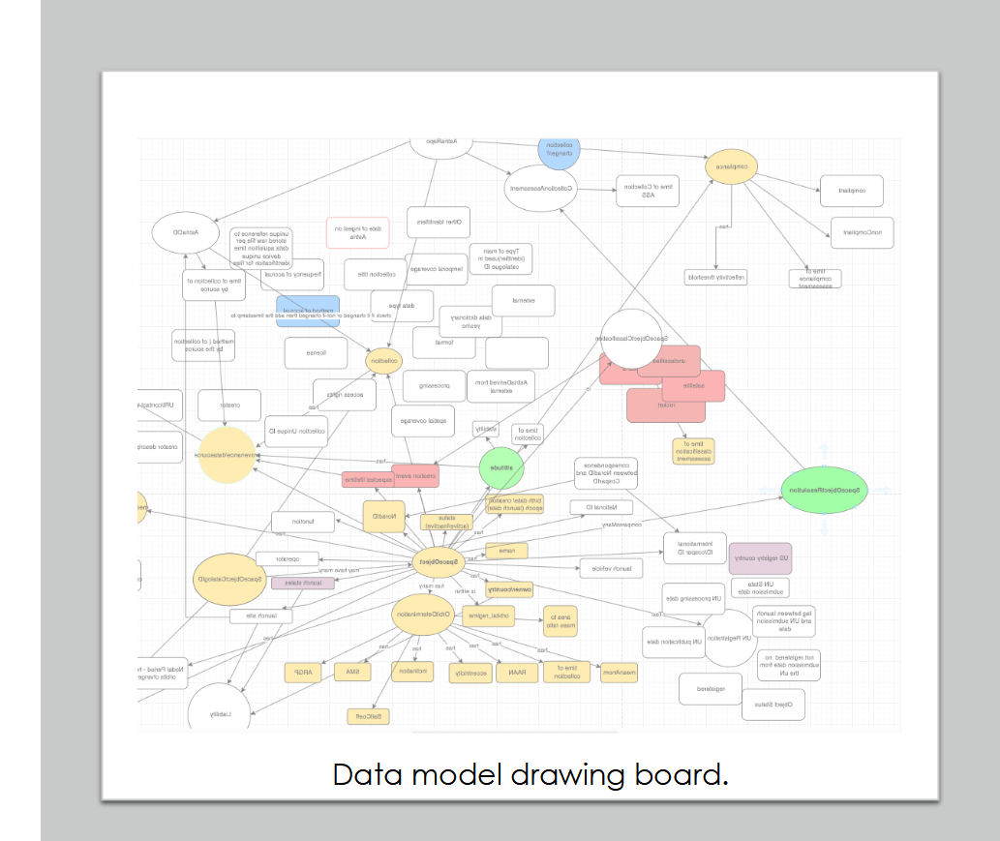 | 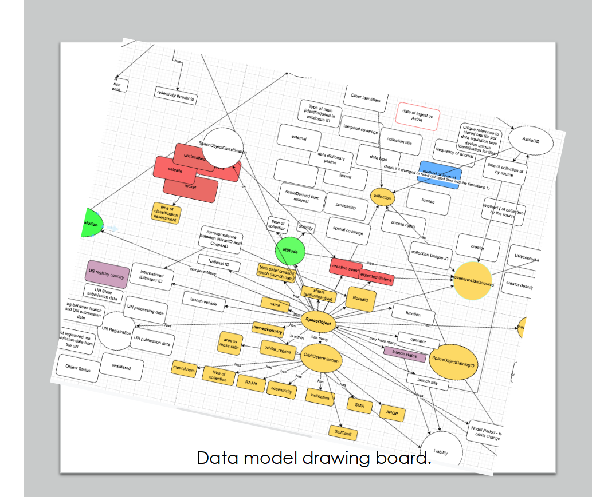 | 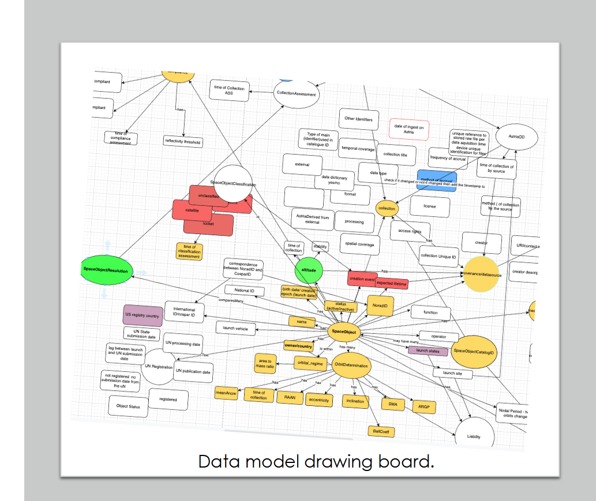 | 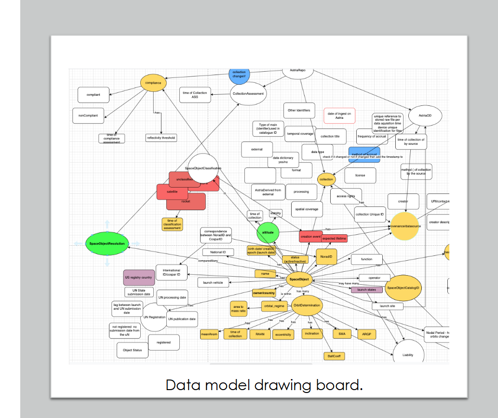 |
| **0.000** | **0.049** | **0.604** | **1.000** |

### Honest work should produce intermediate rewards

Source page 15 restores a state relationship across three target slides. Each panel contains
the three-page comparison; open the image to inspect it at full resolution.

| None repaired | One repaired | Two repaired | All repaired |
|---|---|---|---|
|  | 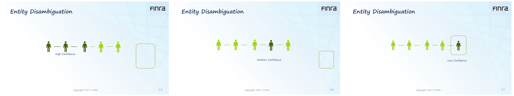 | 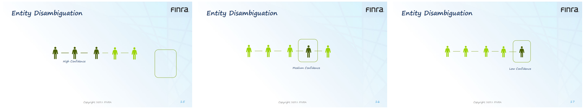 | 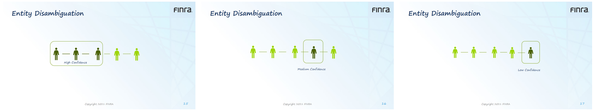 |
| **0.000** | **0.338** | **0.662** | **1.000** |

### A counterexample that exposed weak calibration

Source page 6 is useful precisely because its scores are too flattering. Correct content and
box geometry receive **0.952** even though the table's visible styling is substantially wrong.
The smaller numerical gap between 0.928 and 0.952 does not communicate the large remaining
visual mismatch. This is a calibration failure to investigate, not evidence of accuracy.

| Severe geometry/style errors | Partial style repair | Correct content/box, wrong visible style | Reference |
|---|---|---|---|
| 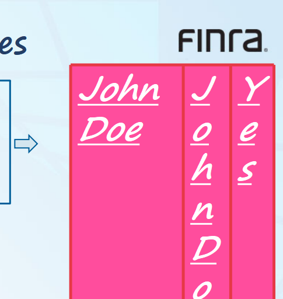 | 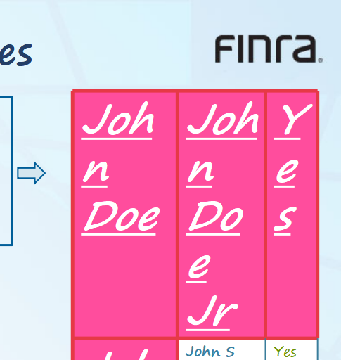 | 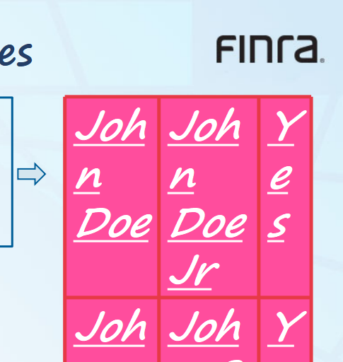 | 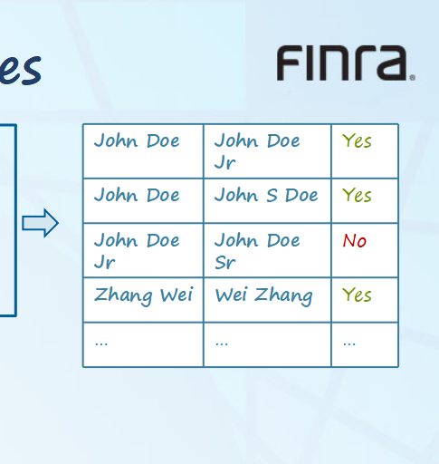 |
| **0.728** | **0.928** | **0.952** | **1.000** |

This motivated the requirement to review actual candidate renders alongside component scores,
not just accept `Init=0 / Oracle=1`. A current-runtime rerun of these historical candidates is
not included, so these images do not certify that this case has been fixed in the open release.

## What users can reproduce today

Run `refract demo --output runs/first-demo` to generate original native candidate files and
measure scores of 0, 0.5 and 1 with this release. That is an executable smoke test, separate
from the historical examples above. For your own tasks, run isolated-repair and adversarial
checks, collect blind review and target-editor roundtrip evidence, then try real-agent canaries.

The open release does not yet implement every historical contract shown here, notably the
complete transform/effect, SmartArt, cross-slide semantic and detailed text-style evaluators.
See [supported scope and boundaries](task-design.md#what-this-release-does-not-yet-establish)
and [editor compatibility](compatibility.md). Mature development experience informs this
framework; acceptance evidence still belongs to a specific evaluator revision and editor.
